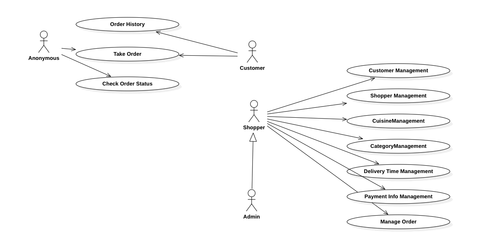
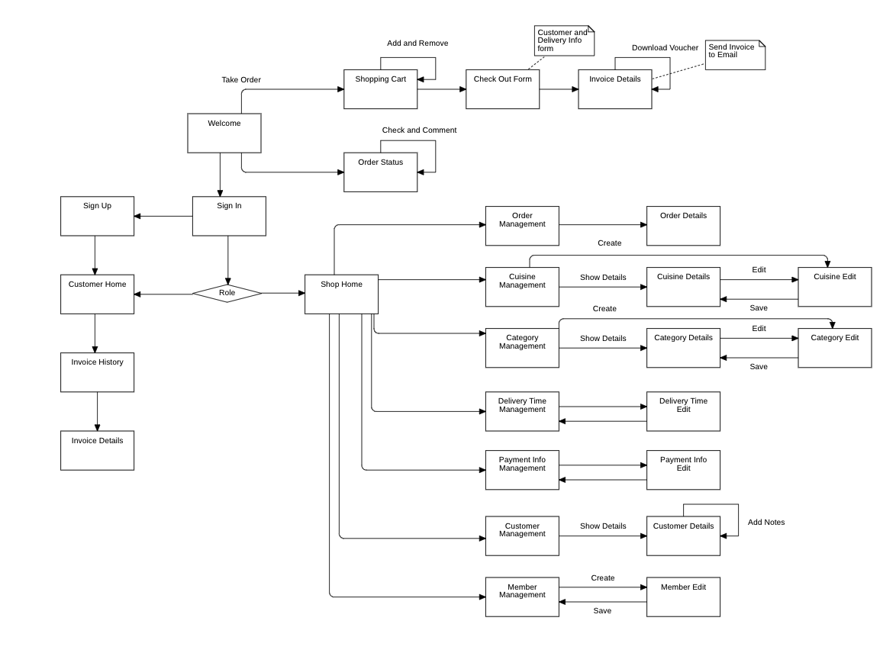
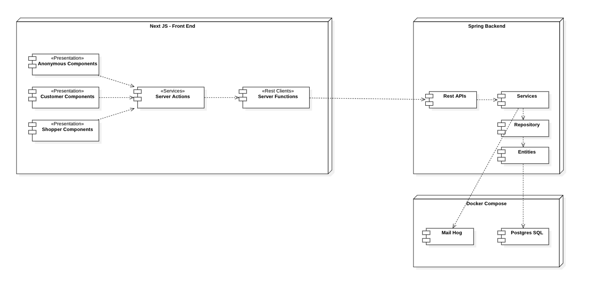

# Foods Order Management System

This is demonstration project for One Stop Batch 16. The purpose of this project is to demonstrate how to consider and implement an application from scratch. 

## Functional Requirements

- Anonymous User and Customer (Member) can order and track order status any time
- Shopper (Shop Owner or Employee of Shop) can also track order and manage status of Order
- Shopper have to prepare master data, such as category, cuisine, delivery time, payment information etc..
- Shopper also have to manage customers and employees.
- Admin User can also do as a shopper for trouble shooting purpose.

## Page Flow Diagram

After writing use case diagram, we have had extracted functional and non functional requirements for this system. For example ordering or customers and order management features are functional requirements. Master data management and account management features are non functional requirements. 

And then we wrote page flow diagrams. Page flow diagram help presentation layer for each requirements. 

## Architecture Design

